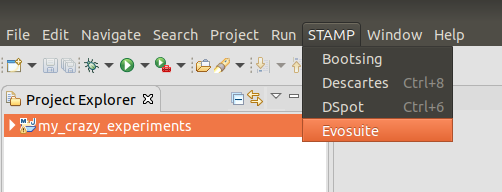
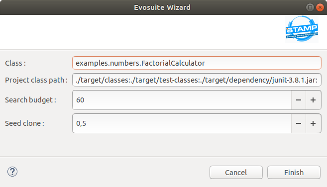
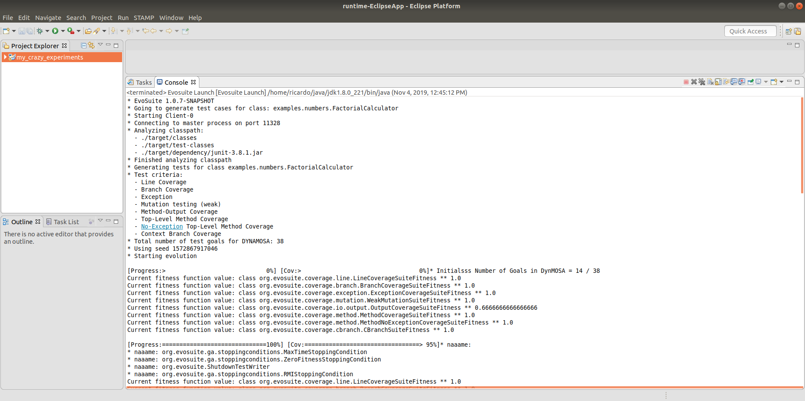
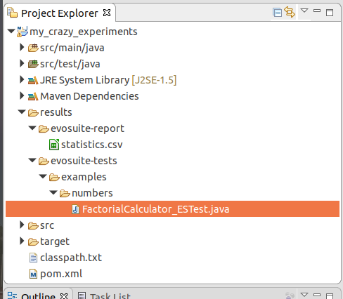

# Evosuite Plugin

## Getting started

### Opening the wizard

1. Select a maven project
2. Go to the main bar and clik STAMP >> Evosuite

### project classpath

The plugin will generate a .txt file with the class path entries of the project
the file will be stored in the project root folder

### Select options

the configurable options are from top to botton :

1. Class : the full qualified name of the class for wich tests will be generated.

2. In the second field you can see the content of the classpath.txt file.

3. Search Budget : an integer number used by Evosuite (see Evosuite documentation).

4. Seed clone: a real number beetwen 0 and 1 used by Evosuite.

### Press finish button

After pressing the finish button the console logs of Evosuite will appear in the Eclipse console.

When Evosuite finish select your project and press F5 you will see a folder called results
containing the generated tests and the .csv files with Evosuite info.

#### Default properties

The Evosuite plugin contains a file called default_values.properties with the default Evosuite launch
properties, the properties in the file that not appear in the wizard are fixed.
