# Dspot Plugin

## Getting Started

### Introduction

This plugin provides a GUI client for using DSpot in the Eclipse IDE,
it works on Eclipse Maven projects.

An Eclipse wizard allows a confortable user's experience, the user can
create, save and load DSpot launch configurations easily.

The DSpot console output is displayed in the Eclipse console, 
and the information in the JSON files generated by DSpot is shown in an Eclipse view.

### Instalation

## User's manual

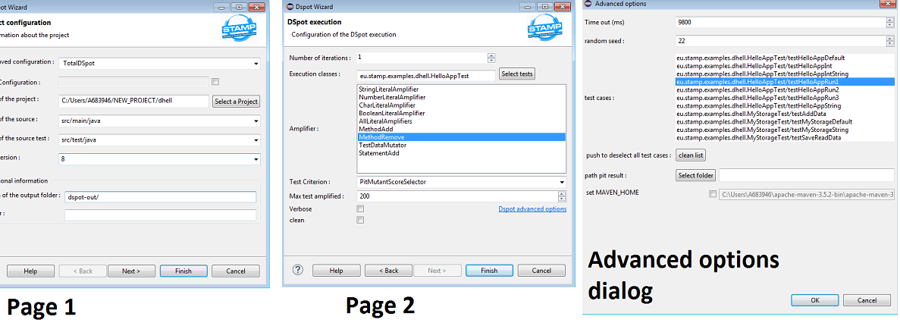

### Opening the wizard

1. Select an Eclipse Maven Project.

2. Open the DSpot wizard, you can open it by right click on the project and then STAMP > DSPOT,
in the main bar STAMP > DSPOT or with ctrl + 6.

### creating a new configuration

To create a new configuration select the check button in the right of the "New configuration" row in page one and write a name for the configuration in the text
after this, select the Dspot parameters in the wizard, when you press finish button your new configuration will be saved and executed.

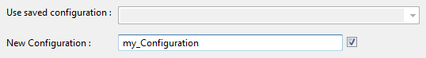

### Loading a stored configuration

To load a stored configuration deselect the check button in the "create configuration" row in page one, the "load configuration" combo will be set ennabled,
then choose the desired configuration in the combo list, when you select a configuration it's parameters are loaded and shown in page one,
if you change this parameters the changes will be saved after pressing the finish button.

### Change of project

Push the select project button (page one) to open a project selection dialog, select a project and press the OK button,
you will see the path of the new project in the "path of the project" text, you can also write the path of the project directly in the text box.

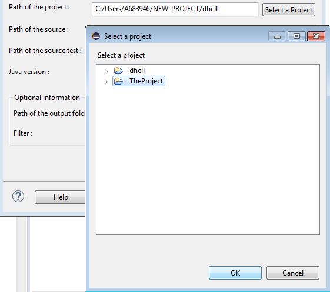

### Check the information about the project

The fields in page one contains information about the project to write the DSpot properties file.

This information is loaded automatically when opening the wizard or changing of project, check them and correct it if necessary.

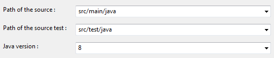

#### Set the path of the sources and the java version

The two rows under the project row, contains combos to select the source folder and the source folder of the test classes, usually the correct
folders are selected after opening the wizard or changing the project, but you can select them, the combos show the source and test source folders
in the project.

Under this combos there is another one for the Java version.

#### Choose an output folder

In the "Optional information" group, at the botton of the first page there is a text box titled "Path of the output folder" to set the path of the folder
to store the reports and files produced by DSpot.

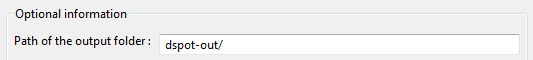

### set the number of iterations

At the top of the second page there is a spinner to set the number of amplification iterations. A larger number may help to improve the test but
it will take more time.

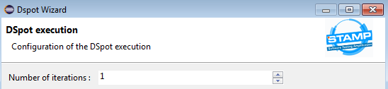

### Select the test classes to amplify 

Push the "Select tests" button in page two, a dialog will be opened, select the test classes to use (multiple selection is allowed), 
you can also write the full names of the tests to use directly in the text box of the same row, separated by : in Mac or Linux and by ; in Windows.

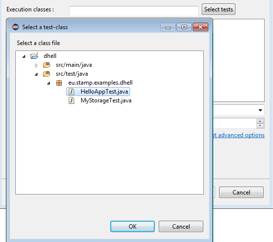
  
  
### Select the amplifier

The list titled "Amplifier" in page two contains the DSpot amplifiers, select them clicking on them (multiple selection is allowed with crtl),
the selected ones appear in blue, if there is not selection all will be used.

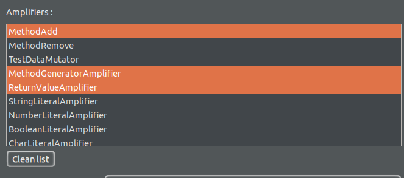
 

### Choose a test criterion

The combo in the "Test Criterion" row in page two, contains a list of the possible criterions to be maximized during the amplification,
if there is not selection the default will be used (PitMutantScoreSelector).

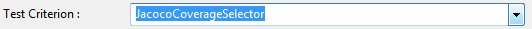

### Select test cases

To select the specific test cases to amplify go to the advanced options dialog clicking on the same name link in page two,
select the case or cases to use in the list titled "test cases", under the list there is a button to clean the list, finally press OK. 

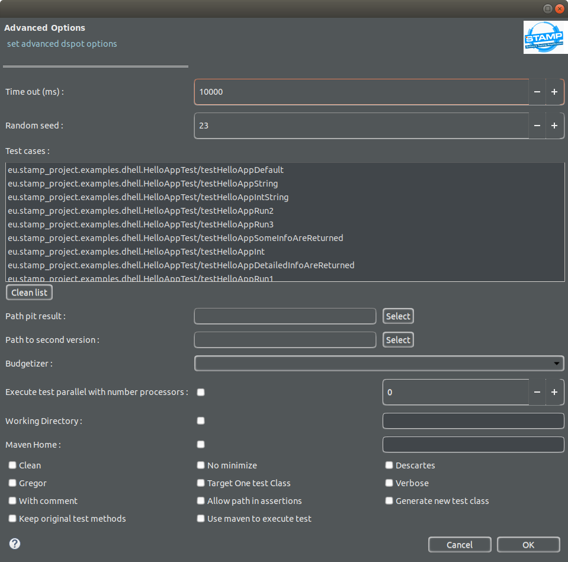

### Max tests amplified

The spinner in the "Max test amplified" row in page two allows specifying the maximum number of amplified tests that dspot keeps before generating assertion.

### Time out and randomm seed

Open the advanced options dialog by clicking the link in page two, the upper spinner is titled "Time out (ms)" 
it specifies the degenerated test's time out.

Under this row there is another spinner titled random seed to specify a seed for the random object the default value is 23

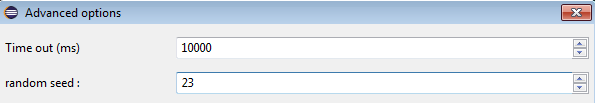

### Path pit result

Open the advanced options dialog by clicking the link in page two, there is a row called "path pit result" 
only enabled if the test criterion is PitMutantScoreSelector, it specifies the path to the .csv of the original result of Pit Test (expert),
select the folder pushing the "Select folder" button or write the path in the text box.

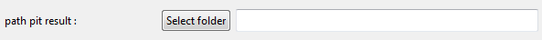

### Verbose and clean

At the left botton of page two there are two check buttons called clean and verbose, verbose shows more information in console, 
if clean is enabled, DSpot will remove the out directory if exists, else it will append the results to the exist files.

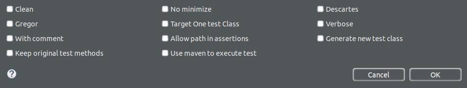

### MAVEN_HOME

If the enviroment variable MAVEN_HOME is not set a warning dialog will prevent you after opening the wizard, you can set the MAVEN_HOME to use
in the advanced options dialog, if you want to do this, select the check button in the row "set MAVEN_HOME" to enable the text box and write the path.

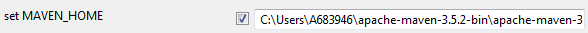

