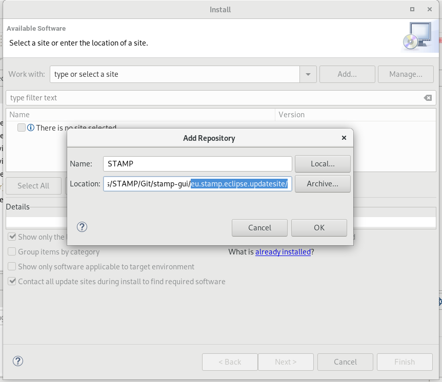
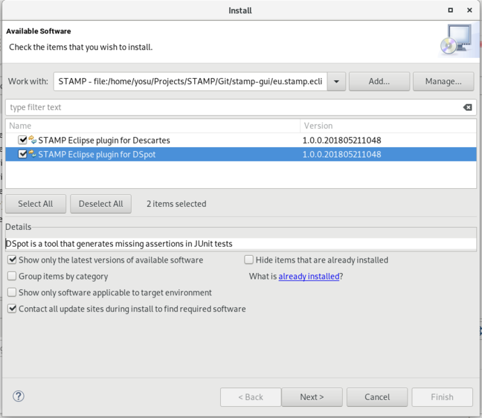

#  STAMP project: Eclipse IDE

This repository contains the code of number of plugins for Eclipse that provides GUI clients for STAMP tools. It also contains an update site to install them.

## Eclipse plugins for STAMP tools

- DSpot: see [DSpot Getting Started guide](README_DSpot.md) for information to install and use DSpot tool.
- Descartes: see [Descartes Getting Started guide](README_Descartes.md) for information to install and use Descartes tool.
- Botsing: see [Botsing Getting Started guide](README_Botsing.md) for information to install and use Botsing tool.

## Installation
The installation of the STAMP Eclipse plugins follows the standard Eclipse plugin installation precedure.

### Requirements
STAMP Eclipse plugins require the following software requirements:
- Git
- Java JDK 8 or above
- Eclipse Oxygen or above

Note: Eclipse needs to be configure with a default JRE instalation pointed to a JDK (not to a JRE)

### Installation precedure
1. In a command line interface (CMI), pull STAMP eclipse-ide repository to get the update site locally:
`git clone https://github.com/STAMP-project/eclipse-ide.git`
This will create a eclipse-ide folder into your local file system

2. In Eclipse, select the top-menu Help/Install New Software. In the Install Wizard, select the Add... button to create a new local repository. Give a name and select the Local... button. Browse your local file system to the Git repository created in previous step. Select the *eu.stamp.eclipse.updatesite* folder

3. In Install wizard, select the STAMP Plugins to install, and select next. Follow next steps, acepting the license and finish. Accept new popup windows that may appear to accept the installation. Restart Eclipse when prompted.

Main contact: Jesús Gorroñogoitia <jesus.gorronogoitia@atos.net>

