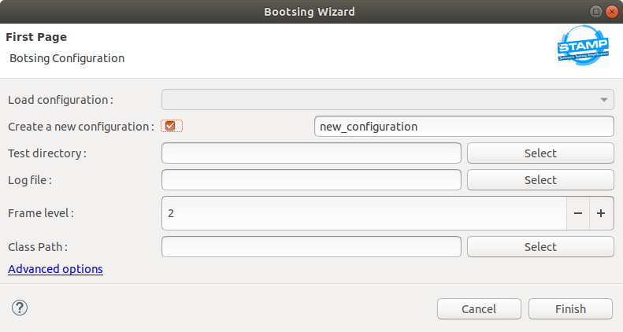
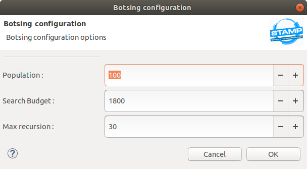

# Botsing Plugin getting started

### Introduction

This plugin provides a GUI client for Botsing in the Eclipse IDE, it provides an Eclipse wizard to create,
save, load and launch Botsing configurations.

## User's manual

### Opening the wizard

To open the wizard go to the main bar STAMP > Botsing.

### Creating a new configuration

In the wizard page there is a row called "Create a new configuration", select the check button 
and write the new configuration name in the text box, after pressing the finish button 
a new configuration will be created and launched.

### Loading a stored configuration

To load an existing configuration deselect the check button in the new configuration row, 
the load configuration combo will become enabled, select the configuration to load in the combo list.

### Selecting the execution parameters

#### Generated tests directory

Select a folder to store the generated tests in the row "Test directory", the button select
opens an explorer to select a folder, you can also write the path in the text both 
or select a folder and write more path segments to create a sub folder for the tests.

If the folder doesn't exists it will be created.

#### Log file

Press the select button in the row "Log file", an explorer will be opened,
select the .log file with the exception trace for Botsing.

#### Frame level

Select the frame level in the spinner of the frame level row.

#### Classpath

Press the select button in the row "Class path " to open an explorer
and select the folder wich contains the jar of the exception and it's dependencies,

The class path will appear in the text box of the classpath row.

### Botsing configuration (optional)

In the botton of the wizard page there is a link called "Advanced options", 
it opens a dialog with spinners to set some config.properties Botsing parameters.

this is optional, if the parameters are not changed the default parameter will be used.

(default parameters are : population = 100, search budget 1800 and max recursion = 30)

### Result

After pressing finish the Botsing execution information will appear in the Eclipse console,
after the execution you will find the generated tests in the specified folder.

