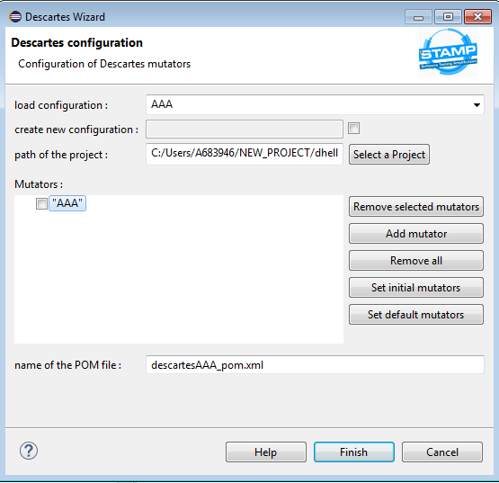
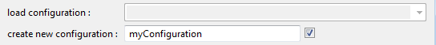
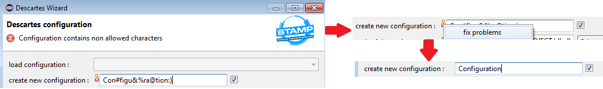
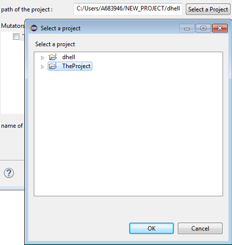
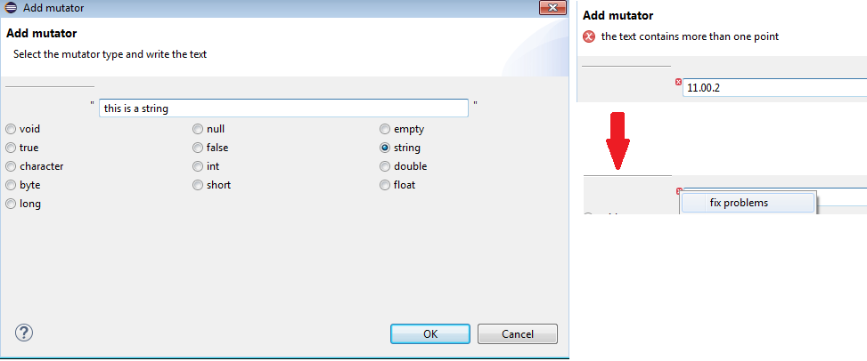
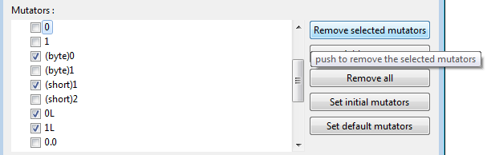
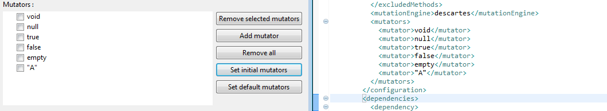
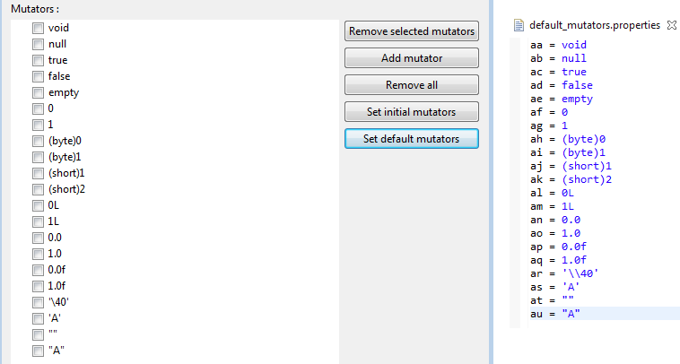
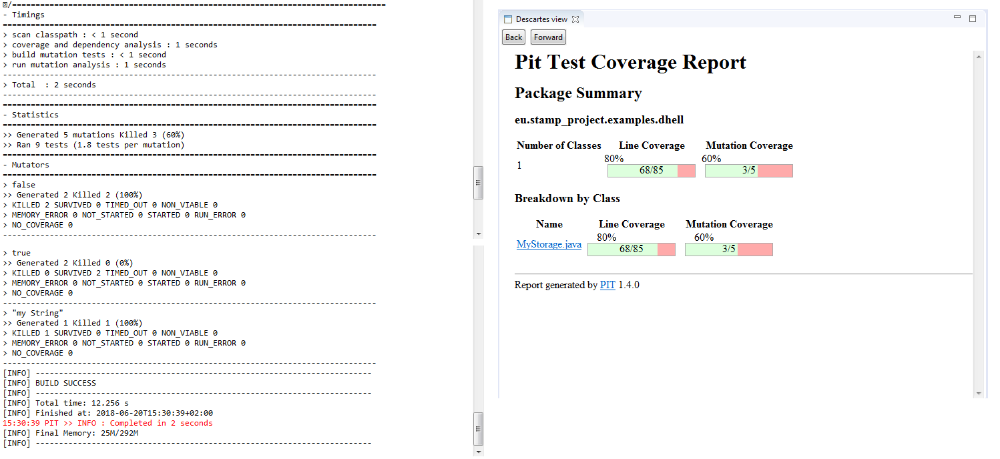

# Descartes Plugin

## Getting Started

### Introduction

This plugin provides a GUI client for Descartes in the Eclipse IDE, it works on Eclipse Maven projects.
An Eclipse wizard allows a confortable user's experience, the user can create, save and load Descartes launch configurations easily.

The wizard allows the user to add and remove mutators easily without manipulating a xml file and the Descartes console output 
is displayed in the Eclipse console.

### Instalation

## User's manual

### Opening the Wizard

1. select a maven project.
2. you can open it by right click on the project and then STAMP > Descartes, in the main bar STAMP > Descartes or with ctrl + 8.

### Creating a new configuration

A Descartes configuration consists of the path of a project, a set of mutators to run Descartes and the name of a pom file.

To create a new configuration select the check button in the right of the "create new configuration" row and write a name for the configuration in the text,
after this select the project mutators and pom file to use, when you press finish your new configuration will be saved and executed.

### Descartes field validation and quick fixers

Descartes wizard includes validation of the text fields, if the text is empty or the content is wrong a red signal will be displayed in the wizard page's head
in the top left corner there will be another signal, click right on it to open a quick fixer menu and push the fix problems option to correct the text.

 

### Loading a stored configuration

To load a stored configuration deselect the check button in the "create configuration" row, the "load configuration" combo will be set ennabled,
then choose the desired configuration in the combo list, when you select a configuration it's parameters are loaded and shown in page one, if you change
this parameters the changes will be saved after pressing the finish button.

### Change of project

Push the select project button to open a project selection dialog, select a project and press the OK button, you will see the path of the new project
in the "path of the project" text, you can also write the path of the project directly in the text box.

### Create a list of mutators

Under the project's row there is a white area with the title mutators, all the mutators in this area will be used, the check buttons to the left of the mutators,  
have the only purpose to use the "Remove selected mutators" button, to the right of this area there is a column of five buttons to manipulate the list.

#### Add a mutator

To add a mutator push the "Add mutator" button to open a dialog, select the type of mutator you want,
if the mutator type requires to write a text like string or int the text will be enabled, write the text of the mutator
and press ok, the necessary sintax like "" for strings, '' for chars or key words as short is provided, the text implements
validation when necessary and a quick fixer for some of the possible problems (open the quick fixer by right
clicking on the error signal on the top left corner of the text).

#### Remove mutators

To remove mutators from the list, select the check buttons in the left of the mutators to remove and push
the "Remove selected mutators" button (that's the only purpose of the check buttons).

If you want to remove all, push the "Remove all" button.

#### Set the initial list of mutators

The initial mutators are those declared in the pom.xml file of the project, when you open the wizard (or when you select a new project)
the initial list is shown in the mutators area, if you want to come back to the initial list, press the "Set initial mutators button".

#### Set default mutators

To set a default list of mutators press the "Set default mutators button".

The default list is taken from a properties file  <path of the project>/files/default_mutators.properties
so you can edit it easily, the list is shown in the wizard, using the alphabetical order of the properties keys,
the mutator with the key ab will be under the mutator with the key aa. 

### Set the name of the Descartes pom file

To execute Descartes the plugin writes an .xml file to use it as pom file in order not to touch the pom.xml of the project,
you can set the name of this file writing a name (it must end with .xml) in the "name of the POM file" text box in the bottom of the page.

### Result

Press the finish button to execute Descartes, you will see the information about the execution in the Eclipse console.

At the end you will see the summary in the console and the Descartes view will be opened to show the information in the html summaries 
produced by Descartes, there will be several tab items, showing the different html documents.

